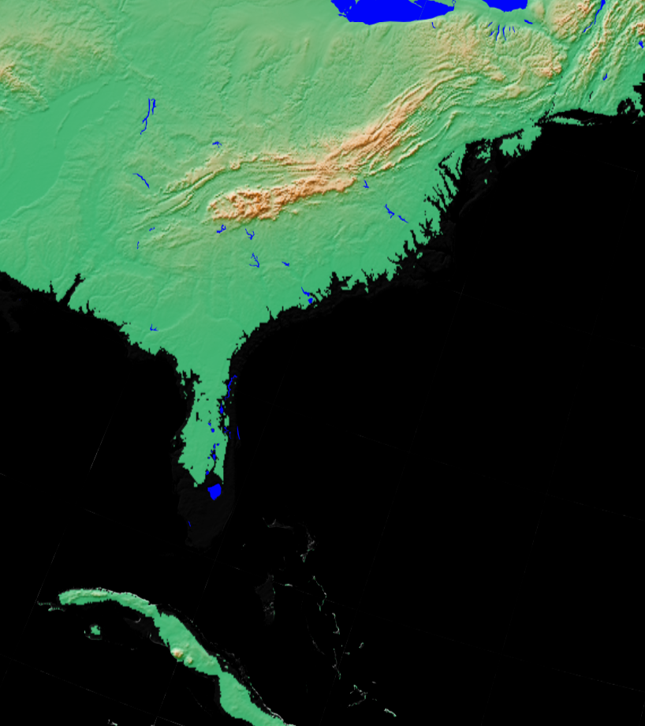

# D&D GMT map setting

A [Generic Mapping Tools](https://docs.generic-mapping-tools.org/) example
of 20-meter sea level rise plus a shift of our rotational axes
so the US east coast isn't as recognizable to our characters.

At sufficent zoom
 
it may not be recognizable.